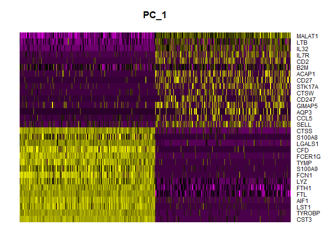

scRNA-seq downstream analyses (Seurat)
================

- [1. Install and/or load the required
  packages](#1-install-andor-load-the-required-packages)
- [2. Set the working directory](#2-set-the-working-directory)
- [3. Load the example dataset and create a Seurat
  object](#3-load-the-example-dataset-and-create-a-seurat-object)
- [3. Pre-processing workflow](#3-pre-processing-workflow)
  - [1. QC plots and data subset](#1-qc-plots-and-data-subset)
  - [2. Data normalization and feature
    selection](#2-data-normalization-and-feature-selection)
- [4. Perform linear dimensional
  reduction](#4-perform-linear-dimensional-reduction)
- [5. Cluster the cells by identification of
  communities](#5-cluster-the-cells-by-identification-of-communities)
- [6. Run non-linear dimensional reduction
  (UMAP/tSNE)](#6-run-non-linear-dimensional-reduction-umaptsne)
- [8. Visializing marker gene
  expression](#8-visializing-marker-gene-expression)

# 1. Install and/or load the required packages

``` r
# install.packages("BiocManager")
  #BiocManager::install("Seurat")
# BiocManager::install(c("phyloseq", "vegan", "microbiome", "Maaslin2"))

library(dplyr)
```

    ## 
    ## Attaching package: 'dplyr'

    ## The following objects are masked from 'package:stats':
    ## 
    ##     filter, lag

    ## The following objects are masked from 'package:base':
    ## 
    ##     intersect, setdiff, setequal, union

``` r
library(Seurat)
```

    ## Loading required package: SeuratObject

    ## Loading required package: sp

    ## 
    ## Attaching package: 'SeuratObject'

    ## The following objects are masked from 'package:base':
    ## 
    ##     intersect, t

``` r
library(patchwork)

library(ggplot2)
library(tidyverse)
```

    ## ── Attaching core tidyverse packages ──────────────────────── tidyverse 2.0.0 ──
    ## ✔ forcats   1.0.0     ✔ stringr   1.5.1
    ## ✔ lubridate 1.9.3     ✔ tibble    3.2.1
    ## ✔ purrr     1.0.2     ✔ tidyr     1.3.1
    ## ✔ readr     2.1.5

    ## ── Conflicts ────────────────────────────────────────── tidyverse_conflicts() ──
    ## ✖ dplyr::filter() masks stats::filter()
    ## ✖ dplyr::lag()    masks stats::lag()
    ## ℹ Use the conflicted package (<http://conflicted.r-lib.org/>) to force all conflicts to become errors

``` r
library(dplyr)
library(data.table)
```

    ## 
    ## Attaching package: 'data.table'
    ## 
    ## The following objects are masked from 'package:lubridate':
    ## 
    ##     hour, isoweek, mday, minute, month, quarter, second, wday, week,
    ##     yday, year
    ## 
    ## The following object is masked from 'package:purrr':
    ## 
    ##     transpose
    ## 
    ## The following objects are masked from 'package:dplyr':
    ## 
    ##     between, first, last

# 2. Set the working directory

``` r
setwd("C://Users//Malina//Desktop//scRNA-seq-analyses/")
```

# 3. Load the example dataset and create a Seurat object

``` r
# Load the PBMC dataset
pbmc.data <- Read10X(data.dir = "filtered_gene_bc_matrices/hg19/")
# Initialize the Seurat object with the raw (non-normalized data).
pbmc <- CreateSeuratObject(counts = pbmc.data, project = "pbmc3k", min.cells = 3, min.features = 200)
```

    ## Warning: Feature names cannot have underscores ('_'), replacing with dashes
    ## ('-')

``` r
pbmc
```

    ## An object of class Seurat 
    ## 13714 features across 2700 samples within 1 assay 
    ## Active assay: RNA (13714 features, 0 variable features)
    ##  1 layer present: counts

``` r
str(pbmc)
```

    ## Formal class 'Seurat' [package "SeuratObject"] with 13 slots
    ##   ..@ assays      :List of 1
    ##   .. ..$ RNA:Formal class 'Assay5' [package "SeuratObject"] with 8 slots
    ##   .. .. .. ..@ layers    :List of 1
    ##   .. .. .. .. ..$ counts:Formal class 'dgCMatrix' [package "Matrix"] with 6 slots
    ##   .. .. .. .. .. .. ..@ i       : int [1:2282976] 29 73 80 148 163 184 186 227 229 230 ...
    ##   .. .. .. .. .. .. ..@ p       : int [1:2701] 0 779 2131 3260 4220 4741 5522 6304 7094 7626 ...
    ##   .. .. .. .. .. .. ..@ Dim     : int [1:2] 13714 2700
    ##   .. .. .. .. .. .. ..@ Dimnames:List of 2
    ##   .. .. .. .. .. .. .. ..$ : NULL
    ##   .. .. .. .. .. .. .. ..$ : NULL
    ##   .. .. .. .. .. .. ..@ x       : num [1:2282976] 1 1 2 1 1 1 1 41 1 1 ...
    ##   .. .. .. .. .. .. ..@ factors : list()
    ##   .. .. .. ..@ cells     :Formal class 'LogMap' [package "SeuratObject"] with 1 slot
    ##   .. .. .. .. .. ..@ .Data: logi [1:2700, 1] TRUE TRUE TRUE TRUE TRUE TRUE ...
    ##   .. .. .. .. .. .. ..- attr(*, "dimnames")=List of 2
    ##   .. .. .. .. .. .. .. ..$ : chr [1:2700] "AAACATACAACCAC-1" "AAACATTGAGCTAC-1" "AAACATTGATCAGC-1" "AAACCGTGCTTCCG-1" ...
    ##   .. .. .. .. .. .. .. ..$ : chr "counts"
    ##   .. .. .. .. .. ..$ dim     : int [1:2] 2700 1
    ##   .. .. .. .. .. ..$ dimnames:List of 2
    ##   .. .. .. .. .. .. ..$ : chr [1:2700] "AAACATACAACCAC-1" "AAACATTGAGCTAC-1" "AAACATTGATCAGC-1" "AAACCGTGCTTCCG-1" ...
    ##   .. .. .. .. .. .. ..$ : chr "counts"
    ##   .. .. .. ..@ features  :Formal class 'LogMap' [package "SeuratObject"] with 1 slot
    ##   .. .. .. .. .. ..@ .Data: logi [1:13714, 1] TRUE TRUE TRUE TRUE TRUE TRUE ...
    ##   .. .. .. .. .. .. ..- attr(*, "dimnames")=List of 2
    ##   .. .. .. .. .. .. .. ..$ : chr [1:13714] "AL627309.1" "AP006222.2" "RP11-206L10.2" "RP11-206L10.9" ...
    ##   .. .. .. .. .. .. .. ..$ : chr "counts"
    ##   .. .. .. .. .. ..$ dim     : int [1:2] 13714 1
    ##   .. .. .. .. .. ..$ dimnames:List of 2
    ##   .. .. .. .. .. .. ..$ : chr [1:13714] "AL627309.1" "AP006222.2" "RP11-206L10.2" "RP11-206L10.9" ...
    ##   .. .. .. .. .. .. ..$ : chr "counts"
    ##   .. .. .. ..@ default   : int 1
    ##   .. .. .. ..@ assay.orig: chr(0) 
    ##   .. .. .. ..@ meta.data :'data.frame':  13714 obs. of  0 variables
    ##   .. .. .. ..@ misc      :List of 1
    ##   .. .. .. .. ..$ calcN: logi TRUE
    ##   .. .. .. ..@ key       : chr "rna_"
    ##   ..@ meta.data   :'data.frame': 2700 obs. of  3 variables:
    ##   .. ..$ orig.ident  : Factor w/ 1 level "pbmc3k": 1 1 1 1 1 1 1 1 1 1 ...
    ##   .. ..$ nCount_RNA  : num [1:2700] 2419 4903 3147 2639 980 ...
    ##   .. ..$ nFeature_RNA: int [1:2700] 779 1352 1129 960 521 781 782 790 532 550 ...
    ##   ..@ active.assay: chr "RNA"
    ##   ..@ active.ident: Factor w/ 1 level "pbmc3k": 1 1 1 1 1 1 1 1 1 1 ...
    ##   .. ..- attr(*, "names")= chr [1:2700] "AAACATACAACCAC-1" "AAACATTGAGCTAC-1" "AAACATTGATCAGC-1" "AAACCGTGCTTCCG-1" ...
    ##   ..@ graphs      : list()
    ##   ..@ neighbors   : list()
    ##   ..@ reductions  : list()
    ##   ..@ images      : list()
    ##   ..@ project.name: chr "pbmc3k"
    ##   ..@ misc        : list()
    ##   ..@ version     :Classes 'package_version', 'numeric_version'  hidden list of 1
    ##   .. ..$ : int [1:3] 5 0 2
    ##   ..@ commands    : list()
    ##   ..@ tools       : list()

``` r
tail(pbmc@meta.data)
```

    ##                  orig.ident nCount_RNA nFeature_RNA
    ## TTTCGAACACCTGA-1     pbmc3k       4455         1539
    ## TTTCGAACTCTCAT-1     pbmc3k       3459         1153
    ## TTTCTACTGAGGCA-1     pbmc3k       3443         1224
    ## TTTCTACTTCCTCG-1     pbmc3k       1684          622
    ## TTTGCATGAGAGGC-1     pbmc3k       1022          452
    ## TTTGCATGCCTCAC-1     pbmc3k       1984          723

# 3. Pre-processing workflow

## 1. QC plots and data subset

``` r
# The [[ operator can add columns to object metadata. This is a great place to stash QC stats
pbmc[["percent.mt"]] <- PercentageFeatureSet(pbmc, pattern = "^MT-")
# Visualize QC metrics as a violin plot
Seurat::VlnPlot(pbmc, features = c("nFeature_RNA", "nCount_RNA", "percent.mt"), ncol = 3)
```

    ## Warning: Default search for "data" layer in "RNA" assay yielded no results;
    ## utilizing "counts" layer instead.

<!-- -->

``` r
# Now plot the feature scatter 

plot1 <- FeatureScatter(pbmc, feature1 = "nCount_RNA", feature2 = "percent.mt")
plot2 <- FeatureScatter(pbmc, feature1 = "nCount_RNA", feature2 = "nFeature_RNA")
plot1 + plot2
```

<!-- -->

``` r
pbmc <- subset(pbmc, subset = nFeature_RNA > 200 & nFeature_RNA < 2500 & percent.mt < 5)
```

## 2. Data normalization and feature selection

After removing unwanted cells from the dataset, the next step is to
normalize the data. By default, we employ a global-scaling normalization
method “LogNormalize” that normalizes the feature expression
measurements for each cell by the total expression, multiplies this by a
scale factor (10,000 by default), and log-transforms the result. In
Seurat v5, Normalized values are stored in pbmc\[\[“RNA”\]\]\$data

``` r
pbmc <- NormalizeData(pbmc, normalization.method = "LogNormalize", scale.factor = 10000)
```

    ## Normalizing layer: counts

We next calculate a subset of features that exhibit high cell-to-cell
variation in the dataset (i.e, they are highly expressed in some cells,
and lowly expressed in others). We and others have found that focusing
on these genes in downstream analysis helps to highlight biological
signal in single-cell datasets.

Our procedure in Seurat is described in detail here, and improves on
previous versions by directly modeling the mean-variance relationship
inherent in single-cell data, and is implemented in the
FindVariableFeatures() function. By default, we return 2,000 features
per dataset. These will be used in downstream analysis, like PCA.

``` r
pbmc <- FindVariableFeatures(pbmc, selection.method = "vst", nfeatures = 2000)
```

    ## Finding variable features for layer counts

``` r
# Identify the 10 most highly variable genes
top10 <- head(VariableFeatures(pbmc), 10)

# plot variable features with and without labels
plot1 <- VariableFeaturePlot(pbmc)
plot2 <- LabelPoints(plot = plot1, points = top10, repel = TRUE)
```

    ## When using repel, set xnudge and ynudge to 0 for optimal results

``` r
plot1 + plot2
```

    ## Warning in scale_x_log10(): log-10 transformation introduced infinite values.
    ## log-10 transformation introduced infinite values.

<!-- -->
\## 3. Data scaling

Next, we apply a linear transformation (‘scaling’) that is a standard
pre-processing step prior to dimensional reduction techniques like PCA.
The ScaleData() function:

Shifts the expression of each gene, so that the mean expression across
cells is 0 Scales the expression of each gene, so that the variance
across cells is 1 This step gives equal weight in downstream analyses,
so that highly-expressed genes do not dominate The results of this are
stored in pbmc\[\[“RNA”\]\]\$scale.data By default, only variable
features are scaled. You can specify the features argument to scale
additional features

``` r
all.genes <- rownames(pbmc)
pbmc <- ScaleData(pbmc, features = all.genes)
```

    ## Centering and scaling data matrix

``` r
#if we have subj iD the variability for which we want to regress 
#the variable has to be in the metadata of course
#pbmc <- ScaleData(pbmc, vars.to.regress = "subj_ID")
```

# 4. Perform linear dimensional reduction

Next we perform PCA on the scaled data. By default, only the previously
determined variable features are used as input, but can be defined using
features argument if you wish to choose a different subset (if you do
want to use a custom subset of features, make sure you pass these to
ScaleData first).

For the first principal components, Seurat outputs a list of genes with
the most positive and negative loadings, representing modules of genes
that exhibit either correlation (or anti-correlation) across
single-cells in the dataset.

``` r
pbmc <- RunPCA(pbmc, features = VariableFeatures(object = pbmc))
```

    ## PC_ 1 
    ## Positive:  CST3, TYROBP, LST1, AIF1, FTL, FTH1, LYZ, FCN1, S100A9, TYMP 
    ##     FCER1G, CFD, LGALS1, S100A8, CTSS, LGALS2, SERPINA1, IFITM3, SPI1, CFP 
    ##     PSAP, IFI30, SAT1, COTL1, S100A11, NPC2, GRN, LGALS3, GSTP1, PYCARD 
    ## Negative:  MALAT1, LTB, IL32, IL7R, CD2, B2M, ACAP1, CD27, STK17A, CTSW 
    ##     CD247, GIMAP5, AQP3, CCL5, SELL, TRAF3IP3, GZMA, MAL, CST7, ITM2A 
    ##     MYC, GIMAP7, HOPX, BEX2, LDLRAP1, GZMK, ETS1, ZAP70, TNFAIP8, RIC3 
    ## PC_ 2 
    ## Positive:  CD79A, MS4A1, TCL1A, HLA-DQA1, HLA-DQB1, HLA-DRA, LINC00926, CD79B, HLA-DRB1, CD74 
    ##     HLA-DMA, HLA-DPB1, HLA-DQA2, CD37, HLA-DRB5, HLA-DMB, HLA-DPA1, FCRLA, HVCN1, LTB 
    ##     BLNK, P2RX5, IGLL5, IRF8, SWAP70, ARHGAP24, FCGR2B, SMIM14, PPP1R14A, C16orf74 
    ## Negative:  NKG7, PRF1, CST7, GZMB, GZMA, FGFBP2, CTSW, GNLY, B2M, SPON2 
    ##     CCL4, GZMH, FCGR3A, CCL5, CD247, XCL2, CLIC3, AKR1C3, SRGN, HOPX 
    ##     TTC38, APMAP, CTSC, S100A4, IGFBP7, ANXA1, ID2, IL32, XCL1, RHOC 
    ## PC_ 3 
    ## Positive:  HLA-DQA1, CD79A, CD79B, HLA-DQB1, HLA-DPB1, HLA-DPA1, CD74, MS4A1, HLA-DRB1, HLA-DRA 
    ##     HLA-DRB5, HLA-DQA2, TCL1A, LINC00926, HLA-DMB, HLA-DMA, CD37, HVCN1, FCRLA, IRF8 
    ##     PLAC8, BLNK, MALAT1, SMIM14, PLD4, P2RX5, IGLL5, LAT2, SWAP70, FCGR2B 
    ## Negative:  PPBP, PF4, SDPR, SPARC, GNG11, NRGN, GP9, RGS18, TUBB1, CLU 
    ##     HIST1H2AC, AP001189.4, ITGA2B, CD9, TMEM40, PTCRA, CA2, ACRBP, MMD, TREML1 
    ##     NGFRAP1, F13A1, SEPT5, RUFY1, TSC22D1, MPP1, CMTM5, RP11-367G6.3, MYL9, GP1BA 
    ## PC_ 4 
    ## Positive:  HLA-DQA1, CD79B, CD79A, MS4A1, HLA-DQB1, CD74, HIST1H2AC, HLA-DPB1, PF4, SDPR 
    ##     TCL1A, HLA-DRB1, HLA-DPA1, HLA-DQA2, PPBP, HLA-DRA, LINC00926, GNG11, SPARC, HLA-DRB5 
    ##     GP9, AP001189.4, CA2, PTCRA, CD9, NRGN, RGS18, CLU, TUBB1, GZMB 
    ## Negative:  VIM, IL7R, S100A6, IL32, S100A8, S100A4, GIMAP7, S100A10, S100A9, MAL 
    ##     AQP3, CD2, CD14, FYB, LGALS2, GIMAP4, ANXA1, CD27, FCN1, RBP7 
    ##     LYZ, S100A11, GIMAP5, MS4A6A, S100A12, FOLR3, TRABD2A, AIF1, IL8, IFI6 
    ## PC_ 5 
    ## Positive:  GZMB, NKG7, S100A8, FGFBP2, GNLY, CCL4, CST7, PRF1, GZMA, SPON2 
    ##     GZMH, S100A9, LGALS2, CCL3, CTSW, XCL2, CD14, CLIC3, S100A12, RBP7 
    ##     CCL5, MS4A6A, GSTP1, FOLR3, IGFBP7, TYROBP, TTC38, AKR1C3, XCL1, HOPX 
    ## Negative:  LTB, IL7R, CKB, VIM, MS4A7, AQP3, CYTIP, RP11-290F20.3, SIGLEC10, HMOX1 
    ##     LILRB2, PTGES3, MAL, CD27, HN1, CD2, GDI2, CORO1B, ANXA5, TUBA1B 
    ##     FAM110A, ATP1A1, TRADD, PPA1, CCDC109B, ABRACL, CTD-2006K23.1, WARS, VMO1, FYB

``` r
# Examine and visualize PCA results a few different ways
print(pbmc[["pca"]], dims = 1:5, nfeatures = 5)
```

    ## PC_ 1 
    ## Positive:  CST3, TYROBP, LST1, AIF1, FTL 
    ## Negative:  MALAT1, LTB, IL32, IL7R, CD2 
    ## PC_ 2 
    ## Positive:  CD79A, MS4A1, TCL1A, HLA-DQA1, HLA-DQB1 
    ## Negative:  NKG7, PRF1, CST7, GZMB, GZMA 
    ## PC_ 3 
    ## Positive:  HLA-DQA1, CD79A, CD79B, HLA-DQB1, HLA-DPB1 
    ## Negative:  PPBP, PF4, SDPR, SPARC, GNG11 
    ## PC_ 4 
    ## Positive:  HLA-DQA1, CD79B, CD79A, MS4A1, HLA-DQB1 
    ## Negative:  VIM, IL7R, S100A6, IL32, S100A8 
    ## PC_ 5 
    ## Positive:  GZMB, NKG7, S100A8, FGFBP2, GNLY 
    ## Negative:  LTB, IL7R, CKB, VIM, MS4A7

``` r
VizDimLoadings(pbmc, dims = 1:2, reduction = "pca")
```

<!-- -->

``` r
DimPlot(pbmc, reduction = "pca") + NoLegend()
```

<!-- -->

In particular DimHeatmap() allows for easy exploration of the primary
sources of heterogeneity in a dataset, and can be useful when trying to
decide which PCs to include for further downstream analyses. Both cells
and features are ordered according to their PCA scores. Setting cells to
a number plots the ‘extreme’ cells on both ends of the spectrum, which
dramatically speeds plotting for large datasets. Though clearly a
supervised analysis, we find this to be a valuable tool for exploring
correlated feature sets.

``` r
DimHeatmap(pbmc, dims = 1, cells = 500, balanced = TRUE)
```

<!-- -->

``` r
DimHeatmap(pbmc, dims = 1:5, cells = 500, balanced = TRUE)
```

<!-- -->

Determine the ‘dimensionality’ of the dataset

``` r
ElbowPlot(pbmc)
```

<!-- -->

We encourage users to repeat downstream analyses with a different number
of PCs (10, 15, or even 50!). As you will observe, the results often do
not differ dramatically. We advise users to err on the higher side when
choosing this parameter. For example, performing downstream analyses
with only 5 PCs does significantly and adversely affect results.

# 5. Cluster the cells by identification of communities

As in PhenoGraph, we first construct a KNN graph based on the euclidean
distance in PCA space, and refine the edge weights between any two cells
based on the shared overlap in their local neighborhoods (Jaccard
similarity). This step is performed using the FindNeighbors() function,
and takes as input the previously defined dimensionality of the dataset
(first 10 PCs). To cluster the cells, we next apply modularity
optimization techniques such as the Louvain algorithm (default) or SLM
\[SLM, Blondel et al., Journal of Statistical Mechanics\], to
iteratively group cells together, with the goal of optimizing the
standard modularity function. The FindClusters() function implements
this procedure, and contains a resolution parameter that sets the
‘granularity’ of the downstream clustering, with increased values
leading to a greater number of clusters. We find that setting this
parameter between 0.4-1.2 typically returns good results for single-cell
datasets of around 3K cells. Optimal resolution often increases for
larger datasets. The clusters can be found using the Idents() function.

``` r
pbmc <- FindNeighbors(pbmc, dims = 1:10)
```

    ## Computing nearest neighbor graph

    ## Computing SNN

``` r
pbmc <- FindClusters(pbmc, resolution = 0.5)
```

    ## Modularity Optimizer version 1.3.0 by Ludo Waltman and Nees Jan van Eck
    ## 
    ## Number of nodes: 2638
    ## Number of edges: 95927
    ## 
    ## Running Louvain algorithm...
    ## Maximum modularity in 10 random starts: 0.8728
    ## Number of communities: 9
    ## Elapsed time: 1 seconds

``` r
# Look at cluster IDs of the first 5 cells
head(Idents(pbmc), 5)
```

    ## AAACATACAACCAC-1 AAACATTGAGCTAC-1 AAACATTGATCAGC-1 AAACCGTGCTTCCG-1 
    ##                2                3                2                1 
    ## AAACCGTGTATGCG-1 
    ##                6 
    ## Levels: 0 1 2 3 4 5 6 7 8

# 6. Run non-linear dimensional reduction (UMAP/tSNE)

Seurat offers several non-linear dimensional reduction techniques, such
as tSNE and UMAP, to visualize and explore these datasets. The goal of
these algorithms is to learn underlying structure in the dataset, in
order to place similar cells together in low-dimensional space.
Therefore, cells that are grouped together within graph-based clusters
determined above should co-localize on these dimension reduction plots.

These methods aim to preserve local distances in the dataset
(i.e. ensuring that cells with very similar gene expression profiles
co-localize), but often do not preserve more global relationships. We
encourage users to leverage techniques like UMAP for visualization, but
to avoid drawing biological conclusions solely on the basis of
visualization techniques.

``` r
pbmc <- RunUMAP(pbmc, dims = 1:10)
```

    ## Warning: The default method for RunUMAP has changed from calling Python UMAP via reticulate to the R-native UWOT using the cosine metric
    ## To use Python UMAP via reticulate, set umap.method to 'umap-learn' and metric to 'correlation'
    ## This message will be shown once per session

    ## 19:23:02 UMAP embedding parameters a = 0.9922 b = 1.112

    ## 19:23:02 Read 2638 rows and found 10 numeric columns

    ## 19:23:02 Using Annoy for neighbor search, n_neighbors = 30

    ## 19:23:02 Building Annoy index with metric = cosine, n_trees = 50

    ## 0%   10   20   30   40   50   60   70   80   90   100%

    ## [----|----|----|----|----|----|----|----|----|----|

    ## **************************************************|
    ## 19:23:04 Writing NN index file to temp file C:\Users\Malina\AppData\Local\Temp\RtmpioBaqN\file2d782e063a2a
    ## 19:23:04 Searching Annoy index using 1 thread, search_k = 3000
    ## 19:23:07 Annoy recall = 100%
    ## 19:23:08 Commencing smooth kNN distance calibration using 1 thread with target n_neighbors = 30
    ## 19:23:10 Initializing from normalized Laplacian + noise (using RSpectra)
    ## 19:23:10 Commencing optimization for 500 epochs, with 105140 positive edges
    ## 19:23:30 Optimization finished

``` r
# note that you can set `label = TRUE` or use the LabelClusters function to help label
# individual clusters
DimPlot(pbmc, reduction = "umap")
```

<!-- -->
\# 7. Finding differentially expressed features (cluster biomarkers)
Seurat can help you find markers that define clusters via differential
expression (DE). By default, it identifies positive and negative markers
of a single cluster (specified in ident.1), compared to all other cells.
FindAllMarkers() automates this process for all clusters, but you can
also test groups of clusters vs. each other, or against all cells.

``` r
# find all markers of cluster 2
cluster2.markers <- FindMarkers(pbmc, ident.1 = 2)


# find all markers distinguishing cluster 5 from clusters 0 and 3
cluster5.markers <- FindMarkers(pbmc, ident.1 = 5, ident.2 = c(0, 3))


# find markers for every cluster compared to all remaining cells, report only the positive
# ones
pbmc.markers <- FindAllMarkers(pbmc, only.pos = TRUE)
pbmc.markers %>%
    group_by(cluster) %>%
    dplyr::filter(avg_log2FC > 1)
```

``` r
# cluster2 vs all others  - top genes
#head(cluster2.markers, n = 5)
# cluster5 vs cluster 3 and cluster 0 - top genes
#head(cluster5.markers, n = 5)
# markers for each cluster relative to all other cells 
#head(pbmc.markers, n = 10)
```

# 8. Visializing marker gene expression

``` r
VlnPlot(pbmc, features = c("MS4A1", "CD79A"))
```

<!-- -->

``` r
# you can plot raw counts as well
VlnPlot(pbmc, features = c("MS4A1", "CD79A"), slot = "counts", log = TRUE)
```

    ## Warning: The `slot` argument of `VlnPlot()` is deprecated as of Seurat 5.0.0.
    ## ℹ Please use the `layer` argument instead.
    ## This warning is displayed once every 8 hours.
    ## Call `lifecycle::last_lifecycle_warnings()` to see where this warning was
    ## generated.

<!-- -->

``` r
FeaturePlot(pbmc, features = c("MS4A1", "GNLY", "CD3E", "CD14"))
```

<!-- -->
\# 9. Assigning cell type identity to clusters

``` r
new.cluster.ids <- c("Naive CD4 T", "CD14+ Mono", "Memory CD4 T", "B", "CD8 T", "FCGR3A+ Mono",
    "NK", "DC", "Platelet")
names(new.cluster.ids) <- levels(pbmc)
head(pbmc@meta.data)
```

    ##                  orig.ident nCount_RNA nFeature_RNA percent.mt RNA_snn_res.0.5
    ## AAACATACAACCAC-1     pbmc3k       2419          779  3.0177759               2
    ## AAACATTGAGCTAC-1     pbmc3k       4903         1352  3.7935958               3
    ## AAACATTGATCAGC-1     pbmc3k       3147         1129  0.8897363               2
    ## AAACCGTGCTTCCG-1     pbmc3k       2639          960  1.7430845               1
    ## AAACCGTGTATGCG-1     pbmc3k        980          521  1.2244898               6
    ## AAACGCACTGGTAC-1     pbmc3k       2163          781  1.6643551               2
    ##                  seurat_clusters
    ## AAACATACAACCAC-1               2
    ## AAACATTGAGCTAC-1               3
    ## AAACATTGATCAGC-1               2
    ## AAACCGTGCTTCCG-1               1
    ## AAACCGTGTATGCG-1               6
    ## AAACGCACTGGTAC-1               2

``` r
pbmc <- RenameIdents(pbmc, new.cluster.ids)
DimPlot(pbmc, reduction = "umap", label = TRUE, pt.size = 0.5) + NoLegend()
```

<!-- -->

``` r
#saveRDS(pbmc, "pbmc_analyses1.rds")
```
